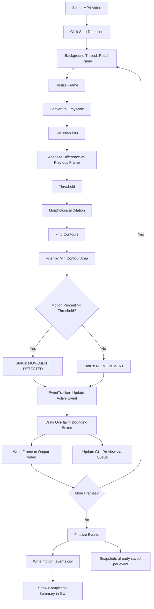

# CCTV-Based Motion Detection and Activity Monitoring System

A lightweight desktop application that analyzes CCTV/MP4 video and flags
frames where visible motion occurs, using classical (non-deep-learning)
computer vision techniques. Built with Python, OpenCV, NumPy, and Tkinter.

---

## Problem Statement

Continuously monitoring CCTV footage manually is tedious and error-prone.
Many small deployments (a home, a shop, a lab room) don't need or can't
afford a full deep-learning-based surveillance pipeline. This project
provides a simple, transparent, CPU-only tool that can review a recorded
video and report *when* and *how much* on-screen movement occurred, without
any neural networks, GPUs, or cloud services.

## Objectives

- Detect frame-to-frame pixel movement in an uploaded video using classical
  image processing.
- Present a simple, responsive desktop GUI for non-technical users.
- Group raw per-frame detections into meaningful motion **events** (with
  start time, end time, and duration) instead of noisy per-frame flags.
- Produce reviewable outputs: an annotated video, a CSV event log, and
  snapshot images.
- Keep the codebase small, readable, and dependency-light.

## Features

- Select any MP4 (or other OpenCV-readable) video file from disk.
- Background-threaded processing so the GUI never freezes.
- Live video preview with overlayed status, timestamp, and motion percentage.
- Bounding boxes drawn around each detected region of movement.
- Temporal event grouping (a short gap in motion does not split one real
  event into many).
- Start / Stop controls, a progress bar, and an event counter.
- Automatic generation of:
  - An annotated output video
  - A CSV report of all motion events
  - A snapshot image for each new event
- "Open Results Folder" button for quick access to output files.
- Fully configurable thresholds in a single `config.py` file.
- Unit-tested core detection and event-tracking logic (pytest).

## Technologies

| Purpose              | Library     |
|-----------------------|-------------|
| Computer vision       | OpenCV (`opencv-python`) |
| Numerical operations  | NumPy |
| GUI                   | Tkinter (Python standard library) |
| Image display in GUI  | Pillow (`PIL`) |
| Testing               | pytest |

No deep learning frameworks, databases, or web servers are used anywhere in
this project.

## Computer Vision Methodology

The detector uses **classical frame-differencing**, a well-established
motion detection technique that does not require any trained model:

1. **Resize** each frame to a fixed width (aspect ratio preserved) for
   consistent, fast processing.
2. **Grayscale** conversion removes color information that isn't needed for
   motion detection and reduces computation.
3. **Gaussian blur** smooths out sensor noise and small irrelevant texture
   detail so it doesn't get mistaken for motion.
4. **Absolute difference** between the current frame and the previous frame
   highlights pixels that changed.
5. **Threshold** converts the difference image into a binary mask: pixels
   that changed "enough" become white, everything else becomes black.
6. **Morphological dilation** fills small holes/gaps in the mask so a single
   moving object forms one solid blob instead of several fragments.
7. **Contour detection** finds the outlines of connected white regions.
8. Contours smaller than `MIN_CONTOUR_AREA` are discarded as noise; the
   remaining contours' combined area, divided by the total frame area, gives
   the **motion percentage**.
9. If the motion percentage exceeds `MOTION_AREA_PERCENT_THRESHOLD`, the
   frame is flagged **MOVEMENT DETECTED**; otherwise **NO MOVEMENT**.
10. Bounding boxes are drawn around each surviving contour for visualization.

### Temporal event logic

Flagging motion frame-by-frame would create dozens of tiny, fragmented
"events" for a single continuous action (e.g. a person walking through a
room for 3 seconds). To avoid this, an `EventTracker` state machine tracks
motion over time:

- A new event **starts** the first time motion is detected after a period of
  no motion.
- The event **stays open** through brief gaps in detection (up to
  `EVENT_GAP_SECONDS`), since real-world motion often has tiny flickers.
- The event **closes** once no motion has been seen for longer than
  `EVENT_GAP_SECONDS`; its recorded end time is the last frame where motion
  was actually observed (not the end of the gap).
- Events shorter than `MIN_EVENT_DURATION_SECONDS` are discarded as noise.

Example:

```text
10.2s → Movement starts
13.1s → Movement stops

Event 1:
Start: 10.2s
End: 13.1s
Duration: 2.9s
```

## System Workflow



## Architecture

```text
cctv-motion-detection/
│
├── main.py                 # CLI entry point; launches the GUI
├── gui.py                  # Tkinter GUI + background-thread orchestration
├── video_processor.py      # Video I/O, per-frame pipeline, CSV/snapshot output
├── motion_detector.py      # Classical CV algorithm + EventTracker state machine
├── config.py               # All tunable parameters and paths
├── requirements.txt
├── README.md
├── .gitignore
├── tests/
│   ├── test_motion_detector.py   # Unit tests for the CV algorithm
│   └── test_event_detection.py   # Unit tests for event tracking + error handling
├── data/
│   └── input/               # Place (or browse to) your input videos here
└── results/
    ├── output_video.mp4     # Generated after processing
    ├── motion_events.csv    # Generated after processing
    └── snapshots/           # One JPG per motion event
```

**Design separation:**
- `motion_detector.py` has no file or GUI dependencies — pure, testable
  image-processing logic operating on NumPy arrays.
- `video_processor.py` has no GUI dependencies — it can be run standalone or
  from tests.
- `gui.py` depends on both, but never runs processing on the main thread; it
  only reads results from a thread-safe queue.

## Installation

Requires **Python 3.9+**.

```bash
# 1. (Recommended) create a virtual environment
python -m venv venv
source venv/bin/activate        # Windows: venv\Scripts\activate

# 2. Install Python dependencies
pip install -r requirements.txt
```

> **Note on Tkinter:** Tkinter ships with most standard Python installers on
> Windows and macOS. On Linux, it is a separate OS package and is not
> installed via pip:
> ```bash
> sudo apt-get install python3-tk      # Debian/Ubuntu
> sudo dnf install python3-tkinter     # Fedora
> ```

## Requirements

See `requirements.txt`:

```text
opencv-python>=4.8.0
numpy>=1.24.0
Pillow>=10.0.0
pytest>=7.4.0
```

## How to Run

```bash
python main.py
```

This opens the GUI directly — no command-line arguments are needed.

## How to Use the GUI

1. Click **Select Video** and choose an `.mp4` file from your computer.
2. Click **Start Detection**. Processing runs in the background; the GUI
   stays responsive.
3. Watch the **video preview** update live with bounding boxes and overlay
   text showing the current status, motion percentage, and timestamp.
4. The **Status** panel shows `MOVEMENT DETECTED` or `NO MOVEMENT`, the
   current motion area percentage, and the elapsed time.
5. The **Events Detected** counter increases each time a new motion event
   begins.
6. Click **Stop** at any time to end processing early; partial results are
   still saved.
7. When finished, click **Open Results Folder** to view the generated
   output video, CSV report, and snapshots.

## Output Explanation

After processing, the `results/` folder contains:

- **`output_video.mp4`** — the input video re-encoded with overlay text
  (`MOVEMENT DETECTED` / `NO MOVEMENT`, timestamp, motion percentage) and
  bounding boxes drawn around moving regions.
- **`motion_events.csv`** — one row per detected motion event:

  | Column | Meaning |
  |---|---|
  | `event_id` | Sequential ID of the event |
  | `start_time` | Seconds into the video when motion started |
  | `end_time` | Seconds into the video when motion last continued |
  | `duration` | `end_time - start_time`, in seconds |
  | `max_motion_percentage` | Peak motion percentage observed during the event |

- **`snapshots/`** — one JPG image captured at the moment each new event
  began (e.g. `event_001.jpg`, `event_002.jpg`, ...).

## Testing

Unit tests cover the CV algorithm and the event-tracking logic using small
synthetic frames (no real video files needed), plus invalid-input handling.

```bash
pytest
```

Tests included:
- No movement between identical frames
- Movement detected between visibly different frames
- Small noise filtered out via the contour-area threshold
- Threshold sensitivity (pixel difference threshold behavior)
- Motion percentage scales with object size
- Frame resizing preserves aspect ratio
- Event start/end timing and duration
- Brief flicker does not split one event into two
- A large gap correctly splits motion into two separate events
- Events shorter than the minimum duration are discarded
- No motion produces zero events
- An invalid/nonexistent video path raises a clear error

## Limitations

This system detects **visual pixel movement only**. It does not understand
*what* is moving or *why*, and it is not a substitute for a monitored
security system. Specifically:

- **Camera shake** (e.g. wind, a bumped mount) can cause false positive
  detections across the entire frame.
- **Lighting changes** (clouds passing, lights turning on/off, headlights)
  can trigger motion detection even with no actual physical movement.
- **Shadows** cast by moving objects are themselves detected as motion.
- **Static cameras give far better results** than handheld or panning
  footage, since the algorithm assumes a fixed background.
- It does **not** identify people, vehicles, or objects — it has no concept
  of "intruder" or "suspicious activity." It only reports that pixels
  changed by more than a configured threshold.
- Very low-light or heavily compressed/noisy video can reduce accuracy.

## Future Improvements

- Optional background-subtraction models (e.g. MOG2) as an alternative,
  still-classical detection mode.
- Region-of-interest masking to ignore known noisy areas (e.g. a tree
  swaying in the wind, a ticking clock).
- Multi-camera / multi-file batch processing.
- Configurable output resolution independent of processing resolution.
- Exportable event timeline visualization.
- Optional email/desktop notification on new event (still no external
  servers required).

## Ethical Considerations

- This tool is intended for lawful monitoring of spaces where the operator
  has the right to record (e.g. their own property, with appropriate
  notice to anyone who may be recorded, in line with local law).
- It performs **motion detection only** — it does not perform facial
  recognition, identity tracking, or any biometric analysis, and it makes
  no claims about a person's intent or behavior.
- Users are responsible for complying with local privacy and surveillance
  laws, including any requirements to inform people that a space is under
  video monitoring.
- Recorded footage and generated outputs may contain personally
  identifiable imagery; store and share results responsibly.

## Conclusion

This project demonstrates that meaningful, useful motion detection can be
built entirely from classical computer vision techniques — no deep learning
required. It is deliberately simple, transparent, and easy to audit: every
step of the detection pipeline (resize, blur, difference, threshold,
contours) is visible and independently testable, making it a solid
foundation for small-scale monitoring tasks or as a teaching example of
classical CV in action.
